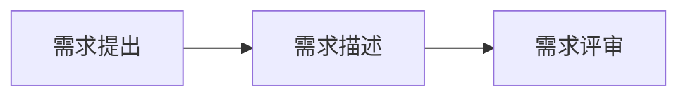
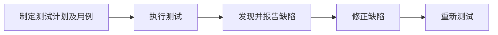
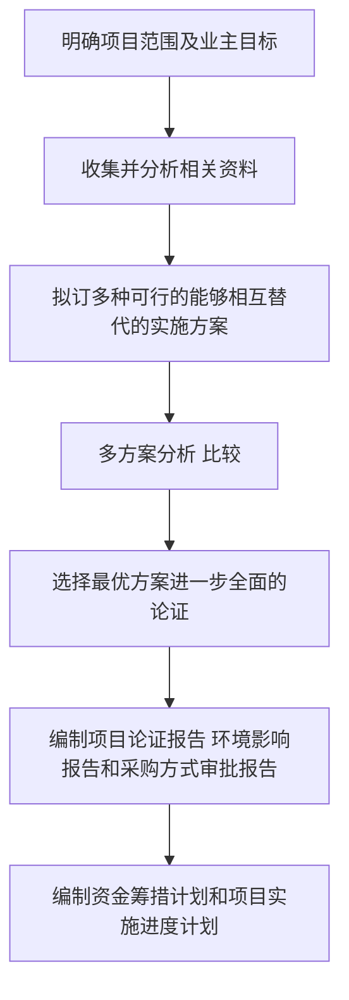

# 1.需求分析3阶段

```mermaid

graph LR
	A[需求提出] --> B[需求描述] --> C[需求评审]

```

# 2.测试管理过程

```mermaid

graph LR
	A[制定测试计划及用例] --> B[执行测试] --> C[发现并报告缺陷] --> D[修正缺陷] --> E[重新测试]

```

# 3.项目论证的主要步骤

```mermaid

graph TD
	A[明确项目范围及业主目标] --> B[收集并分析相关资料] --> C[拟订多种可行的能够相互替代的实施方案] --> D[多方案分析 比较] --> E[选择最优方案进一步全面的论证] --> F[编制项目论证报告 环境影响报告和采购方式审批报告] --> G[编制资金筹措计划和项目实施进度计划]

```

